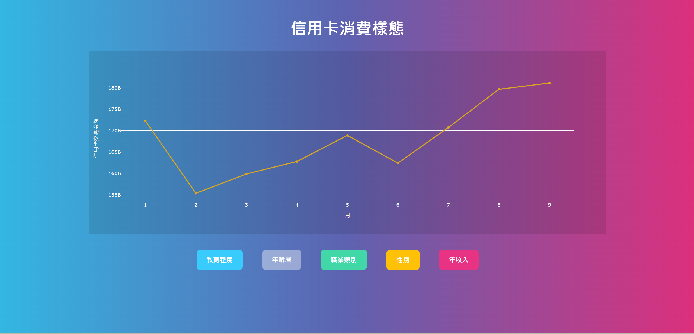

# 信用卡消費樣態

###### 連結：[2023六都信用卡消費樣態](https://dash-web-hm7h.onrender.com)

## Dash
### 以教育程度為例

## 說明
依不同需求，選擇相應資料：
1. 資料類別 [連結到Dash]：職業類別 | 年收入 | 教育程度類別 | 性別 | 年齡層

2. 月份 [目前資料更新至9月]：1－9月 | ALL

3. 地區 [六都]：臺北市 | 新北市 | 桃園市 | 臺中市 | 臺南市 | 高雄市 | ALL

4. 產業別：食 | 衣 | 住 | 行 | 文教康樂 | 百貨 | ALL

## 專題組員
盧宗基 林玫蓀 李亦宣
## 專題目的
依性別、職業、年齡層、教育程度及年收入等多方面因素進行分析，透過資料視覺化呈現消費者使用信用卡的消費習慣性與趨勢。
## 資料說明
1. 資料來源：  
    - data：聯合信用卡處理中心Open API
    - icon：Image by [toffeomurice](https://pixabay.com/users/toffeomurice-3735734/?utm_source=link-attribution&utm_medium=referral&utm_campaign=image&utm_content=2761073) from [Pixabay](https://pixabay.com//?utm_source=link-attribution&utm_medium=referral&utm_campaign=image&utm_content=2761073)

2. 資料範圍：2023年1月－2023年9月